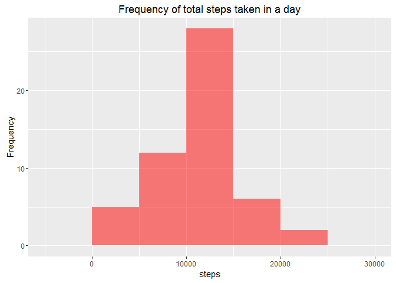
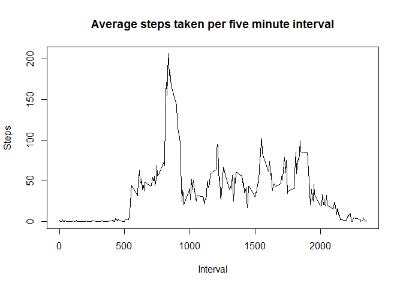
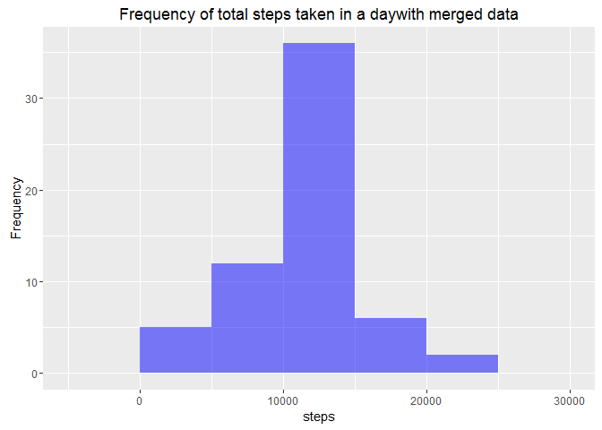

# Coursera Statistical Inference -  Project Part 1
Anil Kumar  
Feb 7, 2016  

## Project Assumptions:
- You have set your working directory to the course project folder.
- You did not move the activity.zip file from the folder root.
- Calculate and report the mean and median (total number of (steps taken per day))
- https://class.coursera.org/repdata-004/forum/thread?thread_id=25#comment-22
- For filling in the missing NA values I chose "the mean for that 5-minute interval"

## Setting directory for 
setwd("~/GitHub/RepData_PeerAssessment1")


## 1. Code for reading in the dataset and/or processing the data

#### a)Unzipping files


```r
if (!file.exists("activity/activity.csv")) {
  unzip("activity/activity.zip")
}

data <- read.csv("activity/activity.csv", colClass=c('integer', 'Date', 'integer'))
```


#### b)Transforming Data

```r
data <- transform(data, 
                      datetime = strptime( paste(date,formatC(interval,width=4,flag="0")), "%Y-%m-%d %H%M"),
                      timeofday = strptime( paste("1970-01-01",formatC(interval,width=4,flag="0")), "%Y-%m-%d %H%M"))
str(data)
```

```
## 'data.frame':	17568 obs. of  5 variables:
##  $ steps    : int  NA NA NA NA NA NA NA NA NA NA ...
##  $ date     : Date, format: "2012-10-01" "2012-10-01" ...
##  $ interval : int  0 5 10 15 20 25 30 35 40 45 ...
##  $ datetime : POSIXct, format: "2012-10-01 00:00:00" "2012-10-01 00:05:00" ...
##  $ timeofday: POSIXct, format: "1970-01-01 00:00:00" "1970-01-01 00:05:00" ...
```

```r
head(data)
```

```
##   steps       date interval            datetime           timeofday
## 1    NA 2012-10-01        0 2012-10-01 00:00:00 1970-01-01 00:00:00
## 2    NA 2012-10-01        5 2012-10-01 00:05:00 1970-01-01 00:05:00
## 3    NA 2012-10-01       10 2012-10-01 00:10:00 1970-01-01 00:10:00
## 4    NA 2012-10-01       15 2012-10-01 00:15:00 1970-01-01 00:15:00
## 5    NA 2012-10-01       20 2012-10-01 00:20:00 1970-01-01 00:20:00
## 6    NA 2012-10-01       25 2012-10-01 00:25:00 1970-01-01 00:25:00
```

```r
summary(data)
```

```
##      steps             date               interval     
##  Min.   :  0.00   Min.   :2012-10-01   Min.   :   0.0  
##  1st Qu.:  0.00   1st Qu.:2012-10-16   1st Qu.: 588.8  
##  Median :  0.00   Median :2012-10-31   Median :1177.5  
##  Mean   : 37.38   Mean   :2012-10-31   Mean   :1177.5  
##  3rd Qu.: 12.00   3rd Qu.:2012-11-15   3rd Qu.:1766.2  
##  Max.   :806.00   Max.   :2012-11-30   Max.   :2355.0  
##  NA's   :2304                                          
##     datetime                     timeofday                  
##  Min.   :2012-10-01 00:00:00   Min.   :1970-01-01 00:00:00  
##  1st Qu.:2012-10-16 05:58:45   1st Qu.:1970-01-01 05:58:45  
##  Median :2012-10-31 11:57:30   Median :1970-01-01 11:57:30  
##  Mean   :2012-10-31 12:24:00   Mean   :1970-01-01 11:57:30  
##  3rd Qu.:2012-11-15 17:56:15   3rd Qu.:1970-01-01 17:56:15  
##  Max.   :2012-11-30 23:55:00   Max.   :1970-01-01 23:55:00  
## 
```


##  2. Histogram of the total number of steps taken each day
In order to create histogram of total number of steps taken each day, we need to sum total of step taken each day and then generate histogram.   
 

```r
library(ggplot2)
plotstepsperday <- function( x ) {
    stepsperday <- aggregate( steps ~ date, data=x, FUN=sum)
    p <- ggplot(stepsperday, aes(steps))
    p <- p + geom_histogram(binwidth=5000,fill="red",alpha=0.5)
    p <- p + labs(y="Frequency",title="Frequency of total steps taken in a day")
    print(p)

    stepsperday 
}
stepsperday <- plotstepsperday( data )
```



## 3. Mean and median number of steps taken each day

Calculating mean and median of the total steps taken per day.

```r
mean(stepsperday$steps)
```

```
## [1] 10766.19
```

```r
median(stepsperday$steps)
```

```
## [1] 10765
```

## 4.Time series plot of the average number of steps taken
Generating time series plot of average number of steps taken.


```r
steps.interval <- aggregate(steps ~ interval, data = data, FUN = mean)
plot(steps.interval, type = "l", main = "Average steps taken per five minute interval",xlab = "Interval" , ylab = "Steps")
```


 
## 5. The 5-minute interval that, on average, contains the maximum number of steps

```r
steps.interval <- aggregate(steps ~ interval, data = data, FUN = mean)

steps.interval$interval[which.max(steps.interval$steps)]
```

```
## [1] 835
```

## 6. Code to describe and show a strategy for imputing missing data

##### a)Identifying   total number of missing values in the dataset (i.e. the total number of rows with NAs)

```r
sum(is.na(data))
```

```
## [1] 2304
```
##### b)Replacing missing values in the dataset with means of 5-minute intervals . 


```r
data <- merge(data, steps.interval, by = "interval", suffixes = c("", 
    ".y"))
nas <- is.na(data$steps)
data$steps[nas] <- data$steps.y[nas]
data <- data[, c(1:3)]
```
## 7. Histogram of the total number of steps taken each day after missing values are imputed

```r
library(ggplot2)
plotstepsperday <- function( x ) {
    stepsperday <- aggregate( steps ~ date, data=x, FUN=sum)
    p <- ggplot(stepsperday, aes(steps))
    p <- p + geom_histogram(binwidth=5000,fill="blue",alpha=0.5)
    p <- p + labs(y="Frequency",title="Frequency of total steps taken in a daywith merged data")
    print(p)

    stepsperday 
}
stepsperday <- plotstepsperday( data )
```


##### Mean and median number of steps taken each day based on merged data


```r
mean(stepsperday$steps)
```

```
## [1] 10766.19
```

```r
median(stepsperday$steps)
```

```
## [1] 10766.19
```

### Note:  The impact of the missing data seems to be lowwhen estimating the total number of steps taken per day.

## 8. Panel plot comparing the average number of steps taken per 5-minute interval across weekdays and weekends

* Creating a new factor variable for weekday and weekend in the using activity dataset.

```r
daytype <- function(date) {
    if (weekdays(as.Date(date)) %in% c("Saturday", "Sunday")) {
        "weekend"
    } else {
        "weekday"
    }
}
data$daytype <- as.factor(sapply(data$date, daytype))
```
* Make a panel plot containing a time series plot (i.e. type = "l") of the 5-minute interval (x-axis) and the average number of steps taken, averaged across all weekday days or weekend days (y-axis).


```r
par(mfrow = c(2, 1))
for (type in c("weekend", "weekday")) {
    steps.type <- aggregate(steps ~ interval, data = data, subset = data$daytype == 
        type, FUN = mean)
    plot(steps.type, type = "l", main = type)
}
```


